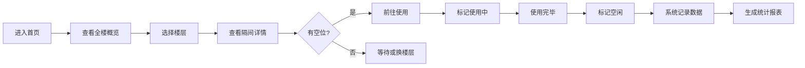

## 1. 产品概述

写字楼厕所实时占用状态监控系统，帮助办公人员快速了解各楼层卫生间占用情况，避免排队等待，提升工作效率。系统支持用户手动标记隔间状态、实时查看全楼卫生间状态、以及通过热力图分析各时段使用频率。

- **目标用户**：写字楼办公人员、物业管理人员
- **核心价值**：减少无效等待、优化卫生间资源配置、提升楼宇管理效率

## 2. 核心功能

### 2.1 用户角色
| 角色 | 注册方式 | 核心权限 |
|------|----------|----------|
| 普通用户 | 无需注册，匿名访问 | 查看各楼层卫生间状态、标记隔间使用状态 |
| 管理员 | 密码登录 | 管理楼层/隔间配置、查看历史统计数据 |

### 2.2 功能模块
1. **首页/总览页**：全楼卫生间占用概览、楼层快速切换、实时状态总览
2. **楼层详情页**：楼层卫生间布局、隔间状态详情、状态标记操作
3. **统计分析页**：使用频率热力图、时段统计、历史趋势图表

### 2.3 页面详情
| 页面名称 | 模块名称 | 功能描述 |
|----------|----------|----------|
| 首页 | 全楼概览卡片 | 展示各楼层卫生间使用数量/总数、占用率 |
| 首页 | 楼层选择器 | 快速切换查看不同楼层 |
| 首页 | 实时状态提示 | 显示当前是否有空闲隔间 |
| 楼层详情页 | 卫生间布局 | 以平面图形式展示隔间位置和状态 |
| 楼层详情页 | 状态标记按钮 | 用户点击标记"使用中/空闲" |
| 楼层详情页 | 预计等待时间 | 根据占用情况估算等待时间 |
| 统计分析页 | 热力图 | 按小时×星期展示使用频率热力图 |
| 统计分析页 | 时段统计 | 展示早高峰、午高峰等关键时段数据 |
| 统计分析页 | 历史趋势 | 近7天/30天使用趋势图表 |

## 3. 核心流程

用户进入系统后，首页展示全楼各楼层卫生间占用概览。用户可选择具体楼层查看隔间详情，如需使用卫生间可先查看是否有空位。用户进入卫生间后可手动标记隔间为"使用中"，离开时标记为"空闲"。系统自动记录每次状态变更，用于生成统计数据和热力图。

## 4. 用户界面设计

### 4.1 设计风格
- **主色调**：深青色（#0D9488），传达卫生、清新、专业的感觉
- **辅助色**：绿色（#22C55E）表示空闲，红色（#EF4444）表示使用中，琥珀色（#F59E0B）表示即将可用
- **按钮风格**：圆角胶囊形按钮，带有微妙阴影和悬浮动效
- **字体**：现代无衬线字体，清晰易读
- **布局风格**：卡片式布局，信息层次分明，留白充足
- **图标风格**：线性图标，简洁现代

### 4.2 页面设计概述
| 页面名称 | 模块名称 | UI元素 |
|----------|----------|--------|
| 首页 | 全楼概览 | 卡片网格布局、状态指示灯、占用率进度条、楼层数字标识 |
| 楼层详情页 | 隔间布局 | 网格化隔间示意图、状态颜色编码、点击交互反馈、动画过渡 |
| 统计分析页 | 热力图 | 颜色渐变热力矩阵、坐标轴标签、悬停详情提示 |

### 4.3 响应式
- 桌面端优先设计，支持平板和手机端自适应
- 移动端单列布局，卡片堆叠展示
- 触控优化：按钮最小尺寸44px，便于手指操作

### 4.4 动效设计
- 状态切换时平滑颜色过渡动画
- 页面进入时元素渐入+上移动效（staggered）
- 热力图hover时放大并显示详细数据
- 卡片悬浮时轻微上浮和阴影加深
