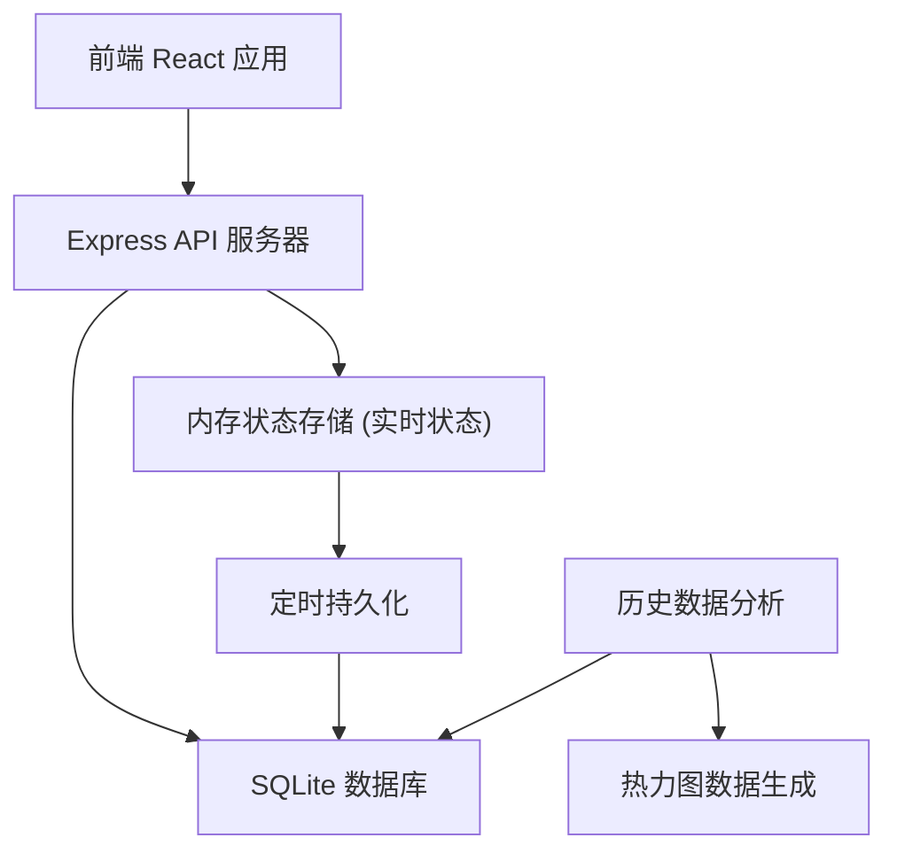
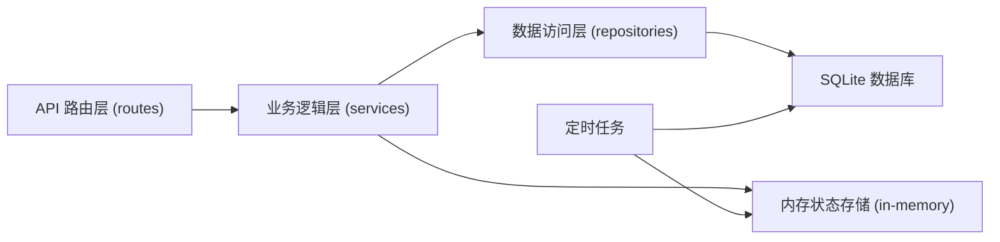
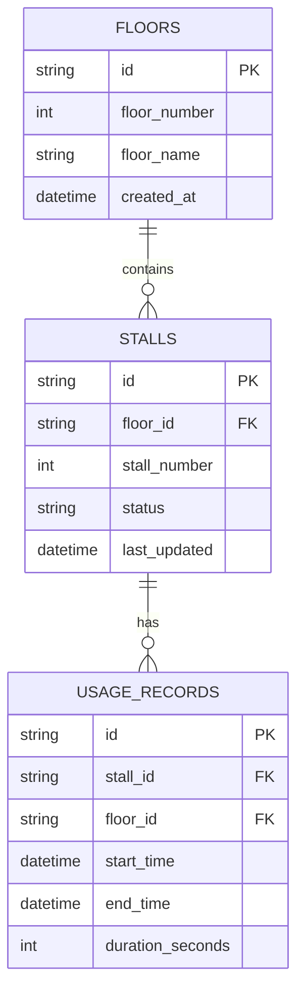

## 1. 架构设计



## 2. 技术描述

- **前端**: React@18 + TypeScript + Tailwind CSS@3 + Vite
- **状态管理**: Zustand
- **路由**: React Router DOM
- **图标库**: Lucide React
- **后端**: Express@4 + TypeScript
- **数据库**: SQLite (轻量级，适合单楼宇部署)
- **实时通信**: 轮询机制 (每5秒刷新，简化实现)
- **初始化工具**: vite-init

## 3. 路由定义

| 路由路径 | 页面名称 | 功能描述 |
|----------|----------|----------|
| / | 首页/总览页 | 全楼卫生间占用概览、楼层快速切换 |
| /floor/:floorId | 楼层详情页 | 楼层隔间布局、状态标记操作 |
| /stats | 统计分析页 | 使用频率热力图、历史趋势 |

## 4. API 定义

### 4.1 类型定义

```typescript
// 隔间状态
type StallStatus = 'available' | 'occupied' | 'maintenance';

// 隔间信息
interface Stall {
  id: string;
  floorId: string;
  stallNumber: number;
  status: StallStatus;
  lastUpdated: number;
}

// 楼层信息
interface Floor {
  id: string;
  floorNumber: number;
  floorName: string;
  totalStalls: number;
  availableStalls: number;
}

// 使用记录
interface UsageRecord {
  id: string;
  stallId: string;
  floorId: string;
  startTime: number;
  endTime: number;
}

// 热力图数据点
interface HeatmapPoint {
  hour: number;    // 0-23
  weekday: number; // 0-6 (0=周日)
  count: number;
}
```

### 4.2 接口列表

| 方法 | 路径 | 功能 | 请求体 | 响应 |
|------|------|------|--------|------|
| GET | /api/floors | 获取所有楼层列表 | - | Floor[] |
| GET | /api/floors/:id/status | 获取楼层隔间实时状态 | - | Stall[] |
| PUT | /api/stalls/:id/status | 更新隔间状态 | { status: StallStatus } | Stall |
| GET | /api/stats/heatmap | 获取热力图数据 | ?days=7 | HeatmapPoint[] |
| GET | /api/stats/trend | 获取历史趋势数据 | ?days=30 | { date: string, count: number }[] |
| GET | /api/stats/peak | 获取高峰时段统计 | - | { period: string, avgCount: number }[] |

## 5. 服务器架构图



## 6. 数据模型

### 6.1 数据模型定义



### 6.2 数据定义语言

```sql
-- 楼层表
CREATE TABLE IF NOT EXISTS floors (
  id TEXT PRIMARY KEY,
  floor_number INTEGER NOT NULL,
  floor_name TEXT NOT NULL,
  created_at DATETIME DEFAULT CURRENT_TIMESTAMP
);

-- 隔间表
CREATE TABLE IF NOT EXISTS stalls (
  id TEXT PRIMARY KEY,
  floor_id TEXT NOT NULL,
  stall_number INTEGER NOT NULL,
  status TEXT NOT NULL DEFAULT 'available',
  last_updated DATETIME DEFAULT CURRENT_TIMESTAMP,
  FOREIGN KEY (floor_id) REFERENCES floors(id)
);

-- 使用记录表
CREATE TABLE IF NOT EXISTS usage_records (
  id TEXT PRIMARY KEY,
  stall_id TEXT NOT NULL,
  floor_id TEXT NOT NULL,
  start_time DATETIME NOT NULL,
  end_time DATETIME,
  duration_seconds INTEGER,
  FOREIGN KEY (stall_id) REFERENCES stalls(id),
  FOREIGN KEY (floor_id) REFERENCES floors(id)
);

-- 索引
CREATE INDEX IF NOT EXISTS idx_usage_floor ON usage_records(floor_id);
CREATE INDEX IF NOT EXISTS idx_usage_time ON usage_records(start_time, end_time);
CREATE INDEX IF NOT EXISTS idx_stalls_floor ON stalls(floor_id);

-- 初始数据：5层楼，每层6个隔间
INSERT OR IGNORE INTO floors (id, floor_number, floor_name) VALUES
  ('floor-1', 1, '1楼 大堂'),
  ('floor-2', 2, '2楼 办公区'),
  ('floor-3', 3, '3楼 办公区'),
  ('floor-4', 4, '4楼 办公区'),
  ('floor-5', 5, '5楼 高管层');
```

## 7. 项目目录结构

```
project/
├── src/                    # 前端代码
│   ├── components/         # 通用组件
│   │   ├── StallCard.tsx
│   │   ├── FloorCard.tsx
│   │   ├── Heatmap.tsx
│   │   └── Navbar.tsx
│   ├── pages/              # 页面
│   │   ├── Home.tsx
│   │   ├── FloorDetail.tsx
│   │   └── Statistics.tsx
│   ├── store/              # 状态管理
│   │   └── useStore.ts
│   ├── utils/              # 工具函数
│   │   └── api.ts
│   ├── types/              # 类型定义
│   │   └── index.ts
│   ├── App.tsx
│   └── main.tsx
├── api/                    # 后端代码
│   ├── routes/             # 路由
│   ├── services/           # 业务逻辑
│   ├── repositories/       # 数据访问
│   ├── db/                 # 数据库
│   └── index.ts
├── shared/                 # 共享类型
├── .trae/documents/        # 项目文档
└── package.json
```
